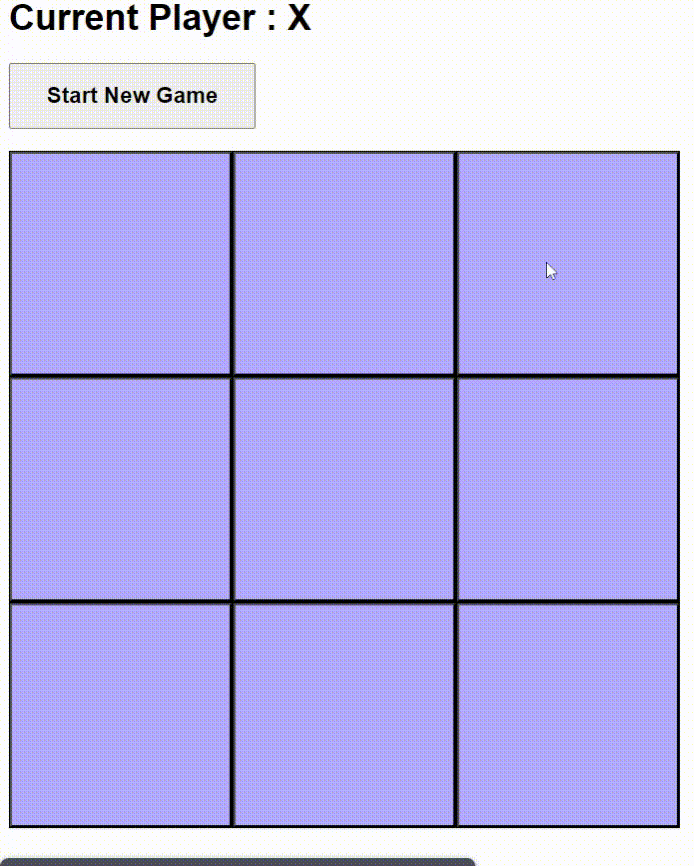

# Tic-Tac-Toe-Angular-pwa

This is a simple Angular application that uses the Angular  framework for server-side rendering using Angular Cli. It's a Tic-Tac-Toe game with a simple UI and some basic game logic.

## The game can be installed on any platform a PWA. try to download it from your browser on desktop.
 
 
 
## Getting Started

To get started with the project, you'll need to have Node.js and npm installed on your machine. Once you have those, you can clone the repository and install the dependencies using the following commands:

```
git clone https://github.com/your-username/xoapp.git
cd xoapp
npm install
```

You can then start the development server using the following command:

```
ng serve
```

This will start the server and you can access the application at http://localhost:4200.

## Building and Running the Application

To build the application for production, you can use the following command:

```
ng build
```

This will create a `dist` directory containing the compiled application. You can then run the application using the following command:

```
npm run serve:ssr:xoapp
```

This will start the server and you can access the application at http://localhost:4200.

## Technologies Used

The application is built using Angular, with Angular Universal for server-side rendering. It also uses the Taiga UI library for the UI components and scss.


